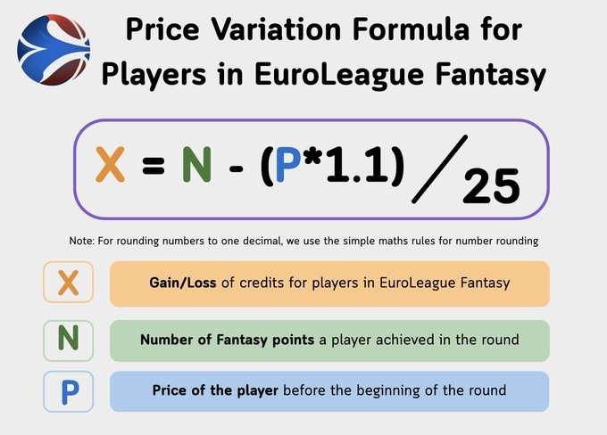

# Euroleague Fantasy Credit Calculator

A powerful Streamlit analytics dashboard for Euroleague Fantasy managers. This tool helps you calculate credit changes, visualize team performance, and automate team imports using AI.

## What This App Does

* **Real-Time Credit Calculator:** Instantly see how your team's value will change based on live game scores.
* **AI Team Import:** Upload a screenshot of your fantasy team (via ChatGPT/Claude) and import it directly into the app—no manual entry required.
* **Visual Lineups:** See your team with official jersey indicators.
* **Coach & Player Logic:** Handles different calculation rules for players (bench and starters) vs. head coaches.

## How It Works

The app uses the **2025/26 Season Credit Formulas** to predict price fluctuations.

> **Credit:** Formulas (plus Pictures) and logic are adapted from analysis by **[@ELFantasist](https://x.com/ELFantasist)**. See the [original breakdown here](https://x.com/ELFantasist/status/2015451800300654732).

### 1. Player Credit Change
**Note: Players have a break-even point roughly 10% higher than their current price.**

### 2. Coach Credit Change
**Note: Coaches use a simplified formula with a larger divisor. Scores are fixed (Win: +10/25, Loss: -5/-20).**

## 🤖 AI Import Feature

To import your team without typing:
1.  Take a screenshot of your fantasy team.
2.  Paste it into ChatGPT or Claude.
3.  Copy the **System Prompt** found in the "ℹ️ AI Prompt & Help" tab of the app.
4.  Paste the code it generates into the sidebar of this app.

---
*Built with [Streamlit](https://streamlit.io) & Python.*